# GCP_Deploy_Test_1

## VCC Assignment 2

### Purpose

Set up a virtual machine in Google Cloud Platform (GCP), implement auto-scaling policies based on workload, and configure security measures like firewall rules and IAM.

### Proposal

Deploy a solution which has following

- Couple of VMs up and running by default
- Auto scaling enabled such that the 2 VMs can be scaled to a maximum of 5 VMs based on workload, when CPU consumption is greater than 60%
- Have them inside a VPC, allow the VMs to use an internal network to communnicate among themselves
- Allow ssh from 1 VM and deny ssh from another VM
- Cut all external network requests using firewall rules, allowing only one SSH from provided IP address.

### Architecture Diagram of Proposal

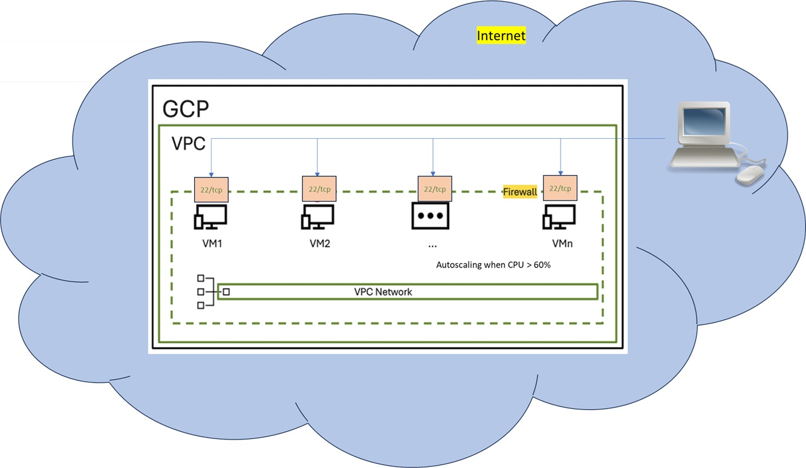

### How to do it

#### Initial Setup

- Install terraform
- Install Google Cloud SDK
- Clone this repository to you local machine and open a terminal in the cloned repo
- Using UI, login to GCP Console and Create the project. Then enable Compute Engine API
  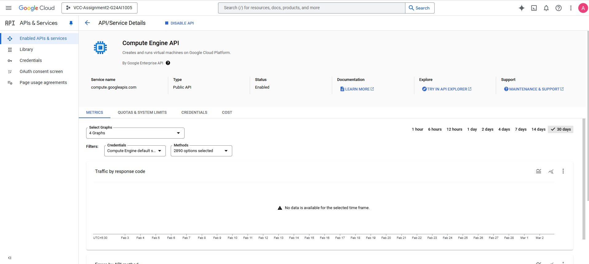

#### Authentication

Execute following commands in sequence

- Login to gcp account using SDK
  `gcloud auth login` (Login in the UI)
  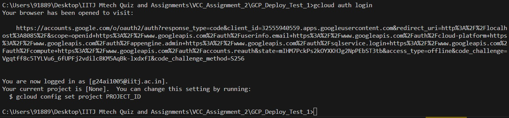
- Create a new service account that will be used for deployment using command `gcloud iam service-accounts create terraform-sa --display-name "Terraform Service Account" --project Project-name` (Replace Project-name with actual project name)
  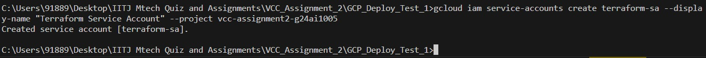
- Add the created service account to project with required IAM role using command `gcloud projects add-iam-policy-binding Project-name --member="serviceAccount:terraform-sa@Project-name.iam.gserviceaccount.com" --role="roles/editor"` (Replace Project-name with actual project name)
  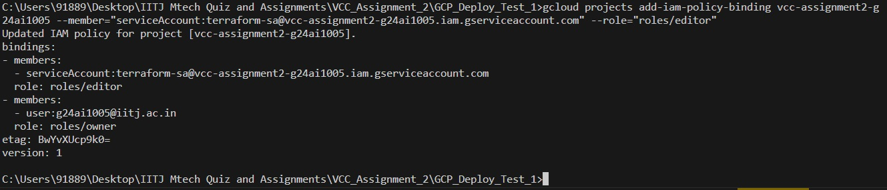
- Crreate a credentials file for terraform to use using command `gcloud iam service-accounts keys create credentials.json --iam-account=terraform-sa@Project-name.iam.gserviceaccount.com`. This should create a creadentials.json file. (Replace Project-name with actual project name)
  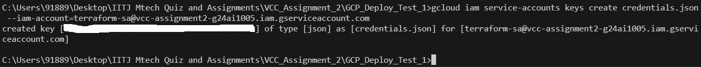

- Add creadentials file to git ignore using command `echo "credentials.json" >> .gitignore`
  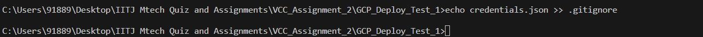

#### Prepare TF Code

Follow these steps to execute the code for deploying the components in GCP

- Go to `terraform.tfvars` file and update Project name

#### Deploy Architecture

Execute commands `terraform init`, `terraform plan -out file_name` and then `terraform apply file_name` to apply the terraform code

### Results

After applying following resources get created in GCP

- VPC
  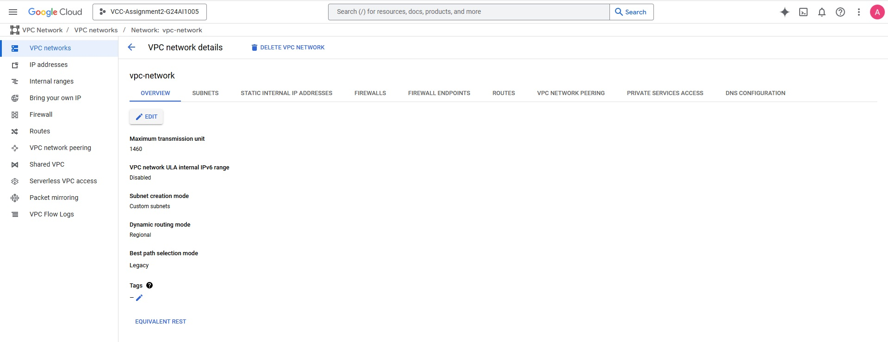
- Subnet
  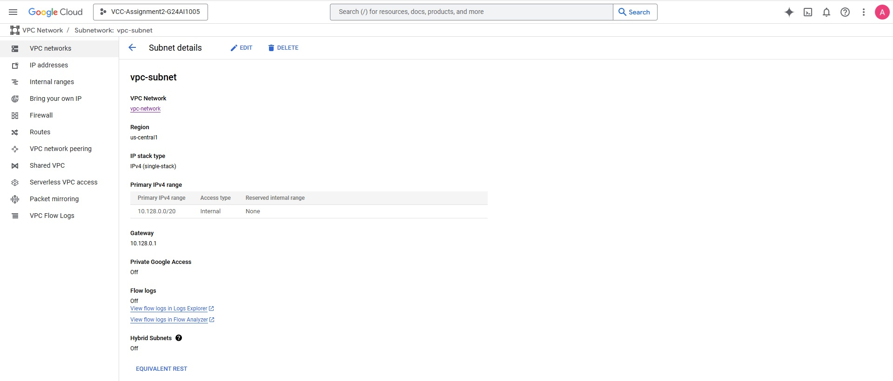
- Instance Group Template
  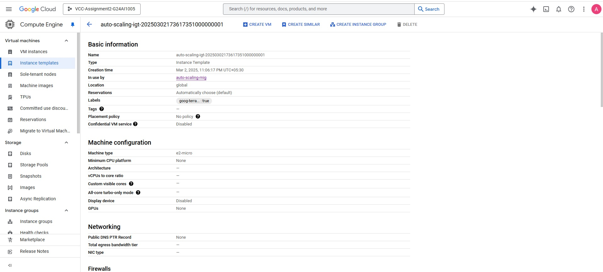
- Instance Group
  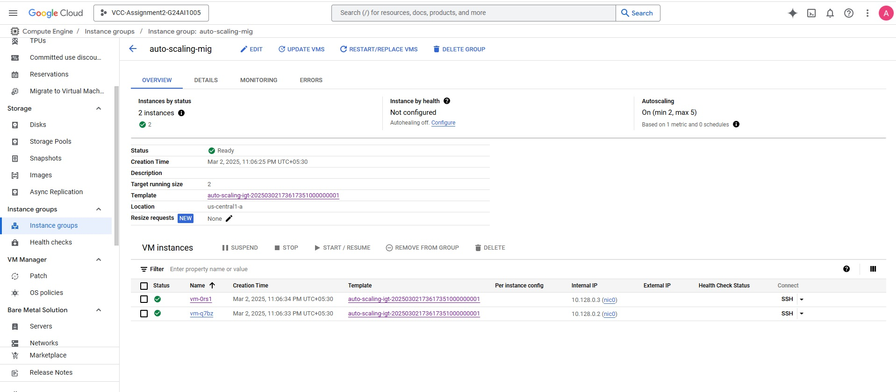
- Test VMs

  - VM1
    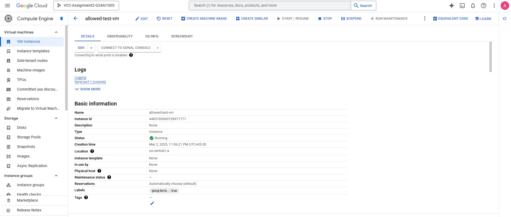
  - VM2
    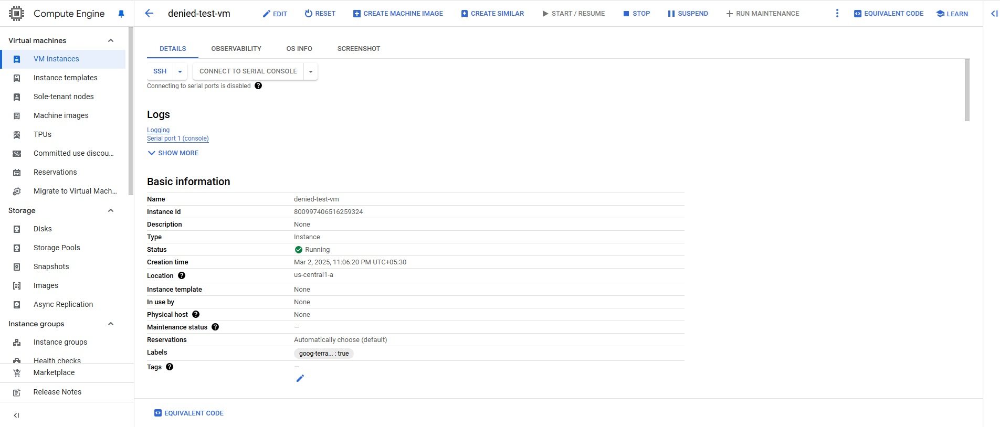
